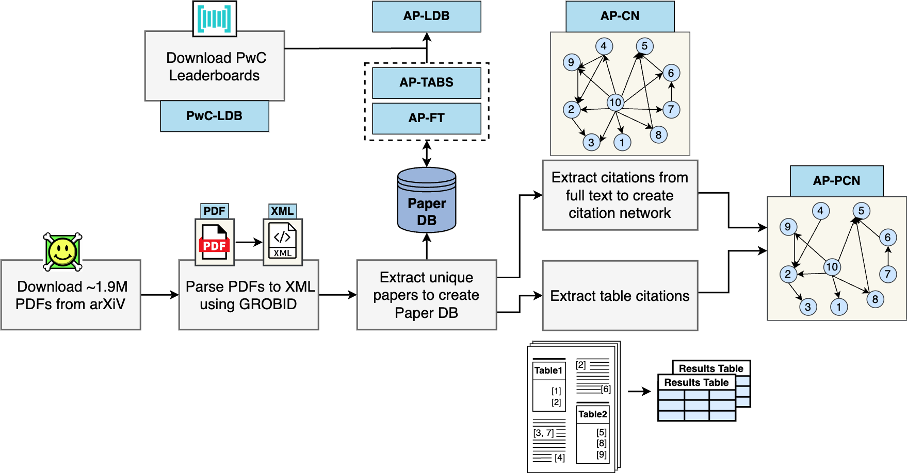

# LEGOBENCH: Scientific Leaderboard Generation Benchmark  


The ever-increasing volume of paper submissions makes it difficult to stay informed about the latest state-of-the-art research. To address this challenge, we introduce LEGOBench, a benchmark for evaluating systems that generate scientific leaderboards. LEGOBench is curated from 22 years of preprint submission data on arXiv and more than 11k machine learning leaderboards on the PapersWithCode portal. We present four graph-based and two language model-based leaderboard generation task configurations. We evaluate popular encoder-only scientific language models as well as decoder-only large language models across these task configurations. State-of-the-art models showcase significant performance gaps in automatic leaderboard generation on LEGOBench.


## Tasks  

**1. Ranking Papers based on Content and Graph \[RPG\]:** Given a short natural language query q (consisting of D, T, and M details), this task format requires ranking candidate papers based on the performance score. There are four configurations in this task with different text and network datasets.  
&emsp; a. RPG\[CN-TABS\]  
&emsp; b. RPG\[PCN-TABS\]  
&emsp; c. RPG\[CN-FT\]  
&emsp; d. RPG\[PCN-FT\]  
**2. Ranking Papers by Prompting Language Models \[RPLM\]:** Given a natural language query q (consisting of D, T, and M details), and a randomly shuffled list of paper titles present in the leaderboard corresponding to <D, T, M>. LMs are expected to generate a ranked list of paper titles, such that the best-ranked paper in the list achieves the best score on <D, T, M>.  
**3. Leaderboard Entries Generation by Prompting Language Models \[LGPLM\]:** LGPLM is modeled as a QA task over documents, where given the query q (consisting of D, T, and M details), and full-text of research papers, a language model extracts method performance from papers experimenting on T and D and reporting scores with M, and ranks the methods based on scores.  


## Dataset Details  

- **Dataset**: The benchmark dataset used in the paper, curated from arXiv and PapersWithCode.
The dataset is available on [OSF](https://osf.io/9v2py/?view_only=6f91b0b510df498ba01595f8f278f94c).  
**APC (arXiv Papers' Collection)** is a curated collection of research papers and graph data (citation network and performance comparison network) from arXiv. We curate titles and abstracts (AP-TABS), full-texts (AP-FT) from arXiv, and process the data to extract the citations (AP-CN) and performance comparisons (AP-PCN).  For more details of the dataset curation please check the [preprint](https://arxiv.org/abs/2401.06233).

  

Figure: LEGOBench data curation pipeline. The blue boxes denote various datasets in the APC collection and the PwC-LDB dataset.  


## Requirements

- Python 3.9 or higher
- For inferencing with VLLM (GPU with compute capability 7.0 or higher)  


## Usage

1. Clone the repository:  

```bash
git clone https://github.com/lingo-iitgn/LEGOBench.git 
```

2. Setup conda environment  
  
```
conda create -n legobench python=3.9
```

3. Install dependencies  

```
conda activate legobench  
pip install -r requirements.txt  
```

To reproduce the results in the paper, please find the details in  `evaluation` directory organized by the three tasks RPG, RPLM, and LGPLM.  


## Preprint
Preprint for LEGOBench can be found [here](https://arxiv.org/abs/2401.06233).  
To cite LEGOBench, please use this:
```
@misc{singh2024legobench,
      title={LEGOBench: Scientific Leaderboard Generation Benchmark}, 
      author={Shruti Singh and Shoaib Alam and Husain Malwat and Mayank Singh},
      year={2024},
      eprint={2401.06233},
      archivePrefix={arXiv},
      primaryClass={cs.CL}
}
```

## Authors  
[Shruti Singh](https://shruti-singh.github.io/), Shoaib Alam, Husain Malwat, [Mayank Singh](https://mayank4490.github.io/)  
[LINGO](https://lingo-iitgn.github.io/), Indian Institute of Technology Gandhinagar, India  

Please feel free to reach out to `singh_shruti@iitgn.ac.in` for any queries.