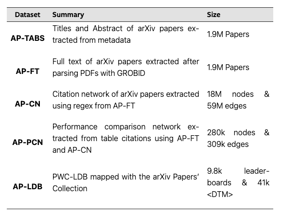

# Dataset Details

This project curates arXiv papers to extract relevant information and generate citation and performance networks. For more details on the dataset, please refer to the [preprint](https://arxiv.org/abs/2401.06233). The entire dataset is publicly available on [OSF](https://osf.io/9v2py/?view_only=6f91b0b510df498ba01595f8f278f94c).  

arXiv Papers' Collection is a collection of datasets curating diverse paper information from arXiv, consisting of the following datasets:  
  

## Installation and Dependencies

To run the curation pipeline, you will need the following dependencies:
- Python 3.x
- Grobid tool for PDF to XML conversion
- BeautifulSoup library for XML parsing
- Graph analysis library (e.g., `networkx` and `snap`)

Please refer to the respective documentation and installation guides for each dependency.

## Code
The `process_leaderboard_data.py` script curates the leaderboard data from PapersWithCode and processes the dataset to extract leaderboards, papers corresponding to the methods in the leaderboard, and determining the direction of the metrics (i.e. whether higher metric scores are good or bad).  

The titles and abstract of arXiv papers are downloaded from the [Kaggle repository](https://www.kaggle.com/datasets/Cornell-University/arxiv) stored in google cloud buckets. Post this, we download the PDFs of the papers from arXiv and parse them using [GROBID](https://github.com/kermitt2/grobid). The parsed full-text is made available as `AP-FT` dataset.  

Similar to citation network, we extract a `performance comparison network` where nodes represent papers and a directed edge between a pair of nodes denote that one of the papers compares the scores of its method/algorithm with the other paper in some table in the paper. The citation network `AP_CN` and the performance comparison network `AP_PCN` are also made available on [OSF](https://osf.io/9v2py/?view_only=6f91b0b510df498ba01595f8f278f94c).