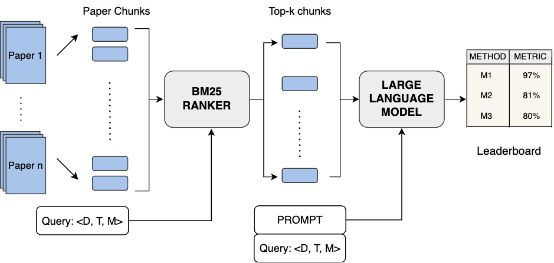

# Leaderboard Entries Generation by Prompting Language Models \[LGPLM\]  

  

Figure: RAG pipeline for leaderboard generation by prompting the language model (LGPLM). Given paper chunks and a query, a BM25 ranker selects the top-10 chunks that are used by an LLM for generating the leaderboard.  
 

   

Table: Performance of LLMs on the LGPLM task.  